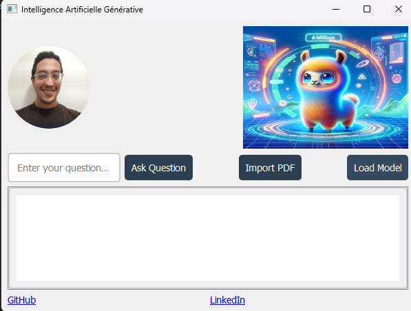

# RAG_APP

#### This is a small app that use an AI model to scan a pdf and answer the question given,

#### it's not compiled as i faced an issue because there is many dependencies thus when compiled the file size is massive ... ! 🙃🤯

### running the APP :

#### python -m venv RAG_APP_REQ

#### RAG_APP_REQ\Scripts\activate

#### pyhon -m pip freeze > reqs.txt
